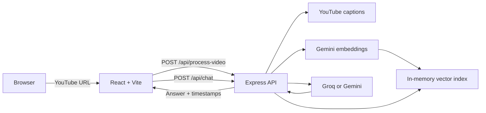

# YouTube Q&A

A JavaScript full-stack RAG application for asking questions about YouTube videos. It retrieves the video's captions, builds a timestamp-aware semantic index, and returns transcript-grounded answers with clickable citations.

## Stack

- Frontend: React 19, Vite 6, Tailwind CSS 4
- Backend: Node.js 20+, Express 5, Zod
- AI: LangChain.js, Gemini embeddings, Groq or Gemini chat models
- Retrieval: in-memory cosine similarity plus maximal marginal relevance (MMR)
- Deployment: Vercel for the frontend and Render for the API

The project contains no Python runtime or Python dependencies.

## Architecture



Indexes are stored in the backend process and capped by `MAX_CACHED_VIDEOS`. They are rebuilt after a process restart.

## Project structure

```text
.
├── backend/
│   ├── src/
│   │   ├── app.js             Express routes, CORS, validation, errors
│   │   ├── config.js          Environment configuration
│   │   ├── rag-pipeline.js    Embedding, MMR retrieval, LLM chain, LRU cache
│   │   ├── transcript.js      YouTube captions and timestamp-aware chunking
│   │   ├── openapi.js         OpenAPI description
│   │   └── server.js          Node process entrypoint
│   ├── test/                  Node test suite
│   └── package.json
├── frontend/                  React/Vite application
└── render.yaml                Render Node service blueprint
```

## Local development

Requirements: Node.js 20.18.1 or newer and npm.

### 1. Configure the backend

```bash
cd backend
cp .env.example .env
npm install
```

Set `GOOGLE_API_KEY` in `backend/.env`; it is required for embeddings. If `LLM_PROVIDER=groq`, also set `GROQ_API_KEY`.

Start the API:

```bash
npm run dev
```

The API runs at `http://127.0.0.1:8000`. Interactive API documentation is at `http://127.0.0.1:8000/docs`.

### 2. Start the frontend

In another terminal:

```bash
cd frontend
cp .env.example .env
npm install
npm run dev
```

Open `http://localhost:5173`.

## API

| Method | Path | Purpose |
| --- | --- | --- |
| `GET` | `/` | Service metadata |
| `GET` | `/api/health` | Provider, credentials, and cache status |
| `POST` | `/api/process-video` | Fetch captions and index `{ "url": "..." }` |
| `POST` | `/api/chat` | Answer `{ "video_id", "question", "history" }` |
| `GET` | `/docs` | Swagger UI |
| `GET` | `/openapi.json` | OpenAPI document |

Example:

```bash
curl -X POST http://127.0.0.1:8000/api/process-video \
  -H "Content-Type: application/json" \
  -d '{"url":"https://www.youtube.com/watch?v=dQw4w9WgXcQ"}'
```

The frontend consumes the same response shape as the previous backend, including `video_id`, video metadata, `duration_label`, and timestamped `sources`.

## Configuration

| Variable | Default | Purpose |
| --- | --- | --- |
| `LLM_PROVIDER` | auto / `groq` | `groq` or `gemini` |
| `GROQ_API_KEY` | empty | Required for Groq generation |
| `GROQ_MODEL` | `openai/gpt-oss-20b` | Groq model |
| `GOOGLE_API_KEY` | empty | Required for embeddings and Gemini generation |
| `GEMINI_MODEL` | `gemini-2.5-flash` | Gemini chat model |
| `EMBEDDING_MODEL` | `gemini-embedding-001` | Gemini embedding model |
| `CHUNK_SIZE` | `1000` | Approximate transcript chunk size in characters |
| `CHUNK_OVERLAP` | `150` | Overlap between adjacent chunks |
| `RETRIEVER_K` | `4` | Excerpts supplied to the chat model |
| `LLM_TEMPERATURE` | `0.2` | Generation temperature |
| `MAX_CACHED_VIDEOS` | `8` | In-memory LRU cache size |
| `TRANSCRIPT_LANGUAGES` | `en,en-US,en-GB` | Preferred caption languages |
| `TRANSCRIPT_PROXY_URL` | empty | Optional HTTP(S) proxy for YouTube requests |
| `ALLOWED_ORIGINS` | local Vite origins | Extra comma-separated browser origins |
| `PORT` | `8000` | API port |
| `VITE_API_BASE_URL` | `http://127.0.0.1:8000` | Frontend API base URL |

## Checks

```bash
cd backend
npm test

cd ../frontend
npm run build
```

## Deployment

### Backend on Render

Create a Blueprint from this repository. `render.yaml` configures a Node service rooted at `backend`, runs `npm ci`, starts it with `npm start`, and checks `/api/health`. Add `GOOGLE_API_KEY`, `GROQ_API_KEY`, and any custom `ALLOWED_ORIGINS` in Render.

Keep one backend process because the vector indexes live in memory. YouTube may rate-limit datacenter addresses; set `TRANSCRIPT_PROXY_URL` when a proxy is required.

### Frontend on Vercel

Import the repository with `frontend` as the root directory and set:

```text
VITE_API_BASE_URL=https://your-render-service.onrender.com
```

Vercel preview domains are accepted automatically. Add a custom frontend domain to `ALLOWED_ORIGINS` on the backend.
