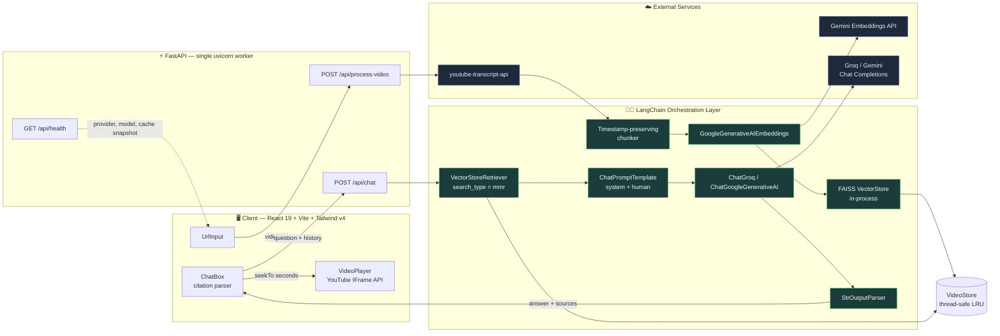
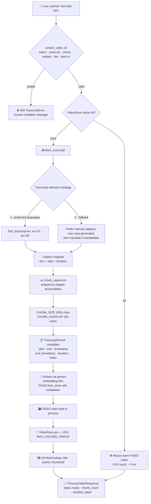
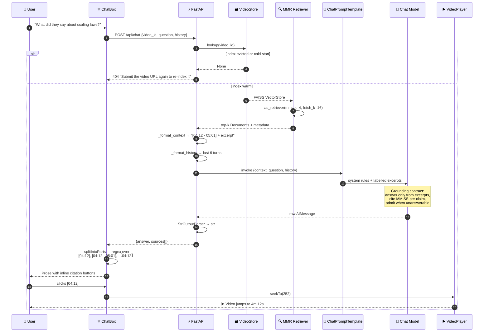
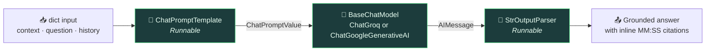
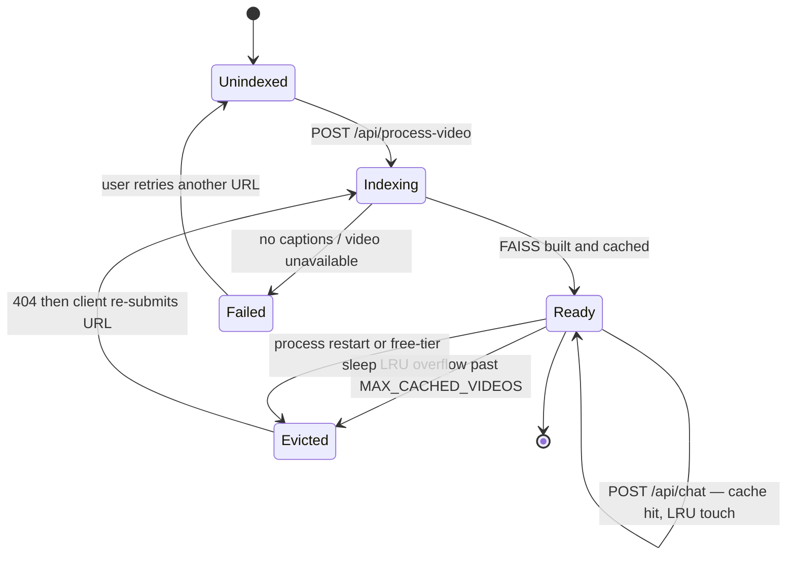
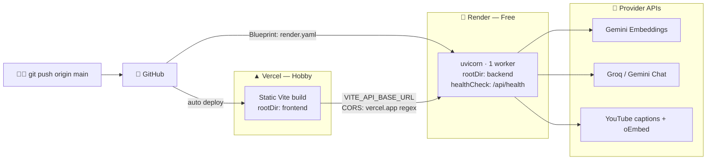

<div align="center">

# 🎬 YouTube Q&A — Timestamp-Grounded RAG over Any Video

**Paste a YouTube link. Ask anything. Get an answer that cites the exact second it came from — and click the citation to jump there.**

[](https://python.langchain.com/)
[](https://faiss.ai/)
[](https://ai.google.dev/)
[](https://console.groq.com/)
[](https://fastapi.tiangolo.com/)
[](https://react.dev/)
[](#-why-it-runs-free)

</div>

---

## 📖 What this is

A production-shaped **Retrieval-Augmented Generation (RAG)** application built on **LangChain**, scoped to a single, tightly-bounded corpus: **one YouTube video's transcript**.

Most RAG demos answer from a pile of PDFs and leave you trusting the model. This one is built around a stricter contract — **every claim must be traceable to a moment in the video**:

1. The transcript is **ingested, chunked with timing metadata preserved, embedded, and indexed** into a FAISS vector store.
2. Your question triggers **MMR (Maximal Marginal Relevance) retrieval** over that index.
3. Retrieved chunks become **labelled context** (`[04:12 - 05:01]`) inside a **`ChatPromptTemplate`**.
4. An **LCEL chain** (`prompt → chat model → output parser`) generates a **grounded answer with inline `[MM:SS]` citations**.
5. The React client parses those citations and turns them into **seek buttons** on the embedded player.

The result: **verifiable AI**. No hallucination-hunting — the evidence is one click away.

---

## ✨ Highlights

| | Capability | How it's done |
| --- | --- | --- |
| 🎯 | **Grounded generation** | System prompt hard-constrains the model to the retrieved excerpts; outside knowledge is explicitly forbidden |
| ⏱️ | **Timestamp-aware chunking** | Custom splitter carries `start` / `end` seconds into every chunk's `Document.metadata` |
| 🔗 | **Clickable citations** | `[04:12]` in the answer → `player.seekTo(252)` on the YouTube IFrame API |
| 🧠 | **MMR retrieval** | `search_type="mmr"` with `fetch_k = 4k` — maximises relevance *and* diversity, so answers aren't sourced from one repetitive stretch |
| 🔌 | **Provider-agnostic LLM** | Swap **Groq** ↔ **Gemini** with one env var; the LCEL chain is untouched |
| 💬 | **Conversational memory** | Sliding buffer window of the last 6 turns folded into the prompt |
| 🗂️ | **Transparent sources** | Every answer ships the retrieved chunks with previews and seek links |
| 🪶 | **Zero local model weights** | Embeddings are an API call — no `torch`, ~180 MB image, instant cold boot |
| 🛡️ | **User-safe error surface** | Domain exceptions map to typed HTTP responses instead of generic 500s |

---

## 🏗️ System Architecture



---

## 🔄 Workflow 1 — Ingestion & Indexing

What happens the moment you paste a URL. This is the **offline half of RAG**: load → split → embed → store.



> **Why a custom splitter and not `RecursiveCharacterTextSplitter`?**
> The stock splitter operates on a flat string — the instant you join caption snippets, the timing is gone. Here chunks are accumulated snippet-by-snippet so each one keeps the `[start, end]` span it actually covers. **That metadata is the entire product.** Without it there are no citations, and without citations there is nothing to click.

---

## 🔄 Workflow 2 — Retrieval & Generation

The **online half of RAG**, end to end, from keystroke to seek.



---

## 🦜🔗 The LCEL Chain

Generation is a **LangChain Expression Language** composition — three `Runnable`s piped into one another. Because every stage is a `Runnable`, the chain gains streaming, batching, and async for free, and swapping the model provider never touches the surrounding code.

```python
# backend/rag_pipeline.py
prompt = ChatPromptTemplate.from_messages([
    ("system", SYSTEM_PROMPT),   # grounding + citation contract
    ("human",  HUMAN_PROMPT),    # {history} {context} {question}
])

chain = prompt | get_llm(settings) | StrOutputParser()

answer = chain.invoke({
    "context":  _format_context(documents),   # "[04:12 - 05:01]\n<excerpt>"
    "question": question,
    "history":  _format_history(history),     # sliding window, 6 turns
})
```



### The grounding contract

The system prompt is the guardrail. It is deliberately narrow, because the value of the app collapses the moment the model answers from parametric memory instead of the transcript:

1. **Answer only from the excerpts.** Never invent facts that are not in them.
2. **Admit gaps.** If the excerpts don't contain the answer, say so and describe what the video *does* cover — no outside-knowledge fallback.
3. **Cite inline** with a single `[MM:SS]` taken from the excerpt label — the moment the point is actually made, never a range.
4. **Every substantive claim needs a citation.**
5. **Be direct**, and match the language of the question.

> The client's citation regex is deliberately forgiving — it accepts `[04:12]`, ranges like `[04:12 - 05:01]`, and even the fullwidth `【04:12】` that models reach for often enough that dropping it would silently cost the reader a seek link.

---

## 🧩 LangChain Component Map

Every LangChain primitive in play, and exactly where it lives:

| LangChain concept | Concrete implementation | Location |
| --- | --- | --- |
| **Document Loader** | `youtube-transcript-api` with language preference + translation fallback | [transcript.py](backend/transcript.py) |
| **Text Splitter** | Custom timestamp-preserving chunker (`chunk_segments`) | [transcript.py](backend/transcript.py) |
| **Document metadata** | `start`, `end`, `timestamp`, `end_timestamp`, `duration`, `index` | [transcript.py](backend/transcript.py) |
| **Embeddings** | `GoogleGenerativeAIEmbeddings` — `models/gemini-embedding-001` | [rag_pipeline.py](backend/rag_pipeline.py) |
| **Vector Store** | `langchain_community.vectorstores.FAISS`, built via `from_texts` | [rag_pipeline.py](backend/rag_pipeline.py) |
| **Retriever** | `VectorStoreRetriever`, `search_type="mmr"`, `k=4`, `fetch_k=16` | [rag_pipeline.py](backend/rag_pipeline.py) |
| **Prompt Template** | `ChatPromptTemplate.from_messages` — system + human | [rag_pipeline.py](backend/rag_pipeline.py) |
| **Chat Model** | `ChatGroq` / `ChatGoogleGenerativeAI`, retries + 60 s timeout | [rag_pipeline.py](backend/rag_pipeline.py) |
| **Output Parser** | `StrOutputParser` | [rag_pipeline.py](backend/rag_pipeline.py) |
| **Chain (LCEL)** | `prompt → llm → parser` `RunnableSequence` | [rag_pipeline.py](backend/rag_pipeline.py) |
| **Memory** | Buffer window of the last `MAX_HISTORY_TURNS = 6` turns, rendered into the prompt | [rag_pipeline.py](backend/rag_pipeline.py) |
| **Serving layer** | FastAPI routes, `run_in_threadpool` for the blocking chain | [app.py](backend/app.py) |

### Retrieval strategy: why MMR

Plain similarity search over a transcript keeps returning **the same passage restated** — speakers repeat themselves, and the top-4 nearest neighbours frequently sit inside one 40-second stretch. **Maximal Marginal Relevance** fetches a wider candidate pool (`fetch_k = 4 × k`) and then greedily selects chunks that are relevant to the query *while being dissimilar to each other*.

In practice that means an answer about a topic discussed at 04:12 **and** 31:40 cites both moments, instead of quoting the first one four times.

### Index lifecycle

A `VideoIndex` is ephemeral by design — the free tier's memory budget is the constraint, and re-indexing costs seconds.



---

## 🛠️ Tech Stack

<table>
<tr><th>Layer</th><th>Choice</th><th>Why</th></tr>
<tr><td><b>Orchestration</b></td><td>LangChain + LCEL</td><td>Composable <code>Runnable</code>s; provider swap without rewrites</td></tr>
<tr><td><b>Embeddings</b></td><td>Gemini <code>gemini-embedding-001</code></td><td>Hosted, so no <code>torch</code>, no weights, no cold-start download</td></tr>
<tr><td><b>Vector DB</b></td><td>FAISS, in-process</td><td>Sub-millisecond ANN search, zero infrastructure to host</td></tr>
<tr><td><b>Generation</b></td><td>Groq <code>openai/gpt-oss-20b</code> · Gemini <code>2.5-flash</code></td><td>Generous free tiers; Groq for latency, Gemini for quality</td></tr>
<tr><td><b>API</b></td><td>FastAPI + Pydantic v2 + uvicorn</td><td>Typed schemas, auto OpenAPI docs, long-lived process keeps the index warm</td></tr>
<tr><td><b>Frontend</b></td><td>React 19 · Vite 6 · Tailwind v4</td><td>Static build, deploys free, no server runtime</td></tr>
<tr><td><b>Player</b></td><td>YouTube IFrame API + graceful fallback</td><td><code>seekTo()</code> when the API loads; remounted embed at <code>?t=</code> when it doesn't</td></tr>
</table>

---

## 📁 Project Structure

```text
├── backend/
│   ├── app.py             ⚡ FastAPI app — routes, CORS, typed exception handlers, lifespan warmup
│   ├── config.py          ⚙️  Frozen Settings dataclass, provider auto-detection, credential guards
│   ├── transcript.py      📜 URL parsing · transcript fetch · timestamp-preserving chunking
│   ├── rag_pipeline.py    🦜 Embeddings · FAISS · MMR retriever · LCEL chain · LRU VideoStore
│   ├── schemas.py         📋 Pydantic request/response contracts
│   ├── requirements.txt
│   └── README.md          Backend and deployment notes
├── frontend/
│   ├── src/
│   │   ├── App.jsx              State machine: idle → loading → ready, message list, seek wiring
│   │   ├── api.js               Typed backend client, FastAPI error-detail unwrapping
│   │   ├── timestamps.js        Citation regex, MM:SS ⇄ seconds, answer tokenisation
│   │   └── components/
│   │       ├── UrlInput.jsx     URL submission and index status
│   │       ├── ChatBox.jsx      Chat transcript, citation buttons, collapsible source list
│   │       └── VideoPlayer.jsx  IFrame API player exposing seekTo() via ref
│   ├── vercel.json        SPA rewrites and immutable asset caching
│   └── vite.config.js
└── render.yaml            Render Blueprint — backend as infrastructure-as-code
```

---

## 🔌 API Reference

| Method | Endpoint | Purpose |
| --- | --- | --- |
| `GET` | `/` | Service index |
| `GET` | `/api/health` | Provider, model, embedding model, credential and cache snapshot |
| `POST` | `/api/process-video` | Ingest → chunk → embed → index a video |
| `POST` | `/api/chat` | Retrieve → augment → generate a cited answer |
| `GET` | `/docs` | Interactive OpenAPI documentation |

<details>
<summary><b>POST /api/process-video</b> — build the vector index</summary>

```jsonc
// Request
{ "url": "https://www.youtube.com/watch?v=dQw4w9WgXcQ" }

// Response 200
{
  "video_id": "dQw4w9WgXcQ",
  "title": "...",
  "author": "...",
  "thumbnail": "https://i.ytimg.com/...",
  "language": "en",
  "duration": 213.0,
  "duration_label": "03:33",
  "chunk_count": 24,
  "segment_count": 187,
  "status": "ready"
}
```

</details>

<details>
<summary><b>POST /api/chat</b> — grounded answer with sources</summary>

```jsonc
// Request
{
  "video_id": "dQw4w9WgXcQ",
  "question": "What does the speaker say about retrieval quality?",
  "history": [
    { "role": "user", "content": "..." },
    { "role": "assistant", "content": "..." }
  ]
}

// Response 200
{
  "video_id": "dQw4w9WgXcQ",
  "question": "...",
  "answer": "They argue retrieval quality dominates model size [04:12], and revisit it with a benchmark later [31:40].",
  "sources": [
    {
      "timestamp": "04:12",
      "end_timestamp": "05:01",
      "start": 252.0,
      "end": 301.0,
      "text": "truncated excerpt preview...",
      "url": "https://www.youtube.com/watch?v=dQw4w9WgXcQ&t=252s"
    }
  ]
}
```

</details>

<details>
<summary><b>Error contract</b> — domain exceptions become typed responses</summary>

Pipeline exceptions carry messages written *for end users*, so they are forwarded verbatim rather than collapsing into a generic 500.

| Status | Exception | Meaning |
| --- | --- | --- |
| `400` | `TranscriptError` | Bad URL, captions disabled, no transcript, empty transcript |
| `404` | `VideoNotIndexedError` | Index evicted or process restarted — re-submit the URL |
| `502` | `PipelineError` | LLM provider call failed |
| `503` | `ConfigError` | Missing API credentials |

</details>

---

## 🚀 Quickstart

### 1. Get your free API keys

| Key | Required? | Where |
| --- | --- | --- |
| `GOOGLE_API_KEY` | **Always** — it serves the retrieval embeddings | <https://aistudio.google.com/app/apikey> |
| `GROQ_API_KEY` | Only when `LLM_PROVIDER=groq` (the default) | <https://console.groq.com/keys> |

> `GOOGLE_API_KEY` is non-negotiable even on Groq: **generation** can come from either provider, but **embeddings** always go through the Gemini API.

### 2. Backend

Python 3.10+. No `torch` dependency, so there are no wheels to wait on — 3.14 works.

```bash
cd backend
python -m venv .venv
source .venv/Scripts/activate      # Windows Git Bash · use .venv/bin/activate on macOS/Linux
pip install -r requirements.txt
cp .env.example .env               # paste your key(s) into .env
uvicorn app:app --reload --port 8000
```

- 📘 OpenAPI docs → <http://127.0.0.1:8000/docs>
- 💚 Health check → <http://127.0.0.1:8000/api/health>

Nothing downloads at boot. The embeddings client is warmed on a background thread during FastAPI's `lifespan`, so credential problems surface in the logs immediately rather than on the first user request.

### 3. Frontend

```bash
cd frontend
npm install
cp .env.example .env               # VITE_API_BASE_URL=http://127.0.0.1:8000
npm run dev
```

Open <http://localhost:5173>, paste a YouTube URL, and start asking.

---

## ⚙️ Configuration Reference

Every knob is environment-driven, so the same code runs unchanged locally and in production.

| Variable | Default | Purpose |
| --- | --- | --- |
| `LLM_PROVIDER` | auto-detected | `groq` or `gemini` — falls back to whichever key exists |
| `GROQ_MODEL` | `openai/gpt-oss-20b` | Groq chat model |
| `GEMINI_MODEL` | `gemini-2.5-flash` | Gemini chat model |
| `EMBEDDING_MODEL` | `models/gemini-embedding-001` | Embedding model for the vector index |
| `CHUNK_SIZE` | `1000` | Characters per transcript chunk |
| `CHUNK_OVERLAP` | `150` | Character overlap, clamped to at most half the chunk size |
| `RETRIEVER_K` | `4` | Chunks retrieved per question (`fetch_k` = 4 × this) |
| `LLM_TEMPERATURE` | `0.2` | Low by design — this is an extraction task, not a creative one |
| `MAX_CACHED_VIDEOS` | `8` | In-memory FAISS indexes retained before LRU eviction |
| `TRANSCRIPT_LANGUAGES` | `en,en-US,en-GB` | Preferred caption languages, in order |
| `TRANSCRIPT_PROXY_URL` | unset | Outbound proxy for transcript fetches |
| `ALLOWED_ORIGINS` | localhost dev ports | Extra CORS origins (`*.vercel.app` is already allowed by regex) |
| `VITE_API_BASE_URL` | `http://127.0.0.1:8000` | Frontend → backend base URL, inlined at build time |

### Tuning notes

- **Longer, denser videos** → raise `RETRIEVER_K` to 6–8 so the context window sees more of the discussion.
- **Rambling or repetitive speakers** → raise `CHUNK_SIZE` so a single chunk carries a complete thought.
- **Precise fact lookup** → lower `CHUNK_SIZE` for sharper, more localised citations.
- **Temperature** is intentionally 0.2; push it higher and citation discipline degrades before prose quality improves.

---

## ☁️ Deployment



### Backend → Render

`render.yaml` is a **Blueprint**: the service is defined in code, not clicked together in a dashboard.

1. **New → Blueprint**, select this repository. Render reads `render.yaml` and proposes a free web service rooted at `backend/`.
2. Render prompts for the secrets marked `sync: false`:
   - `GOOGLE_API_KEY` — always required (embeddings)
   - `GROQ_API_KEY` — required while `LLM_PROVIDER=groq`
   - `ALLOWED_ORIGINS` — only for a custom domain; leave blank otherwise
3. **Apply.** The first build takes a few minutes; every later push to `main` redeploys automatically.

> ⚠️ **Keep it to a single worker.** The FAISS index lives *inside the process* — extra workers would each hold their own copy and miss each other's cache.

### Frontend → Vercel

1. Import the repo, set **Root Directory** to `frontend`.
2. Framework preset **Vite** — build `npm run build`, output `dist`.
3. Add `VITE_API_BASE_URL` = your Render URL (e.g. `https://youtube-qa-api.onrender.com`, no trailing slash).
4. Deploy. `vercel.json` handles SPA rewrites and immutable asset caching.

> Vite **inlines env vars at build time** — changing `VITE_API_BASE_URL` requires a redeploy, not just a restart.

---

## 💸 Why it runs free

| Concern | Choice | Cost |
| --- | --- | --- |
| Embeddings | `gemini-embedding-001` via API | Free tier · **no local weights** |
| Vector DB | FAISS, in-process | Free · no service to host |
| LLM | Groq `openai/gpt-oss-20b` or Gemini `2.5-flash` | Free API tiers |
| Backend | FastAPI, ~180 MB image | Fits any free tier |
| Frontend | Vercel static build | Free hobby tier |

**The key decision:** embeddings are an **API call, not a local model**. Dropping `sentence-transformers` removed `torch` and its weights — the image shrank well inside free-tier limits, and boot went from "download a model" to "open a client".

---

## 🧯 Troubleshooting

<details>
<summary><b>"No transcript is available for this video"</b></summary>

The video has captions disabled, or none in your configured languages. Try another video, or extend `TRANSCRIPT_LANGUAGES`. The fetcher already prefers manual captions over auto-generated ones and will translate a translatable track when needed.

</details>

<details>
<summary><b>Transcript fetches work locally but fail in production</b></summary>

YouTube rate-limits and blocks many datacenter IP ranges. Set `TRANSCRIPT_PROXY_URL` on the backend service to route transcript requests through a proxy.

</details>

<details>
<summary><b>"This video is not loaded yet"</b></summary>

The service restarted, slept, or the index was LRU-evicted — vector stores are in-memory by design. Submit the URL again; re-indexing takes seconds.

</details>

<details>
<summary><b>CORS errors in the browser console</b></summary>

Add the exact frontend origin to `ALLOWED_ORIGINS` — scheme included, no trailing slash. `*.vercel.app` preview deployments are already allowed by regex.

</details>

<details>
<summary><b>Slow first request after a quiet period</b></summary>

Render's free plan sleeps the service after 15 minutes idle. The next request pays a cold start and re-indexes whatever video it needs.

</details>

<details>
<summary><b>Rate limits on long videos</b></summary>

Free-tier Gemini embeddings allow 100 requests/minute. Videos beyond roughly an hour can exceed that during a single index build. Raise `CHUNK_SIZE` to emit fewer, larger chunks.

</details>

<details>
<summary><b><code>npm run</code> fails on Windows</b></summary>

The repository path contains <code>&</code>, which breaks npm's default <code>cmd.exe</code> script shell. <code>frontend/.npmrc</code> switches it to bash; renaming the folder to something like <code>YTQA</code> fixes it permanently.

</details>

---

<div align="center">

**Built with 🦜🔗 LangChain · FAISS · FastAPI · React**

*Transcripts come from YouTube captions. Answers are grounded in the transcript only.*

</div>
